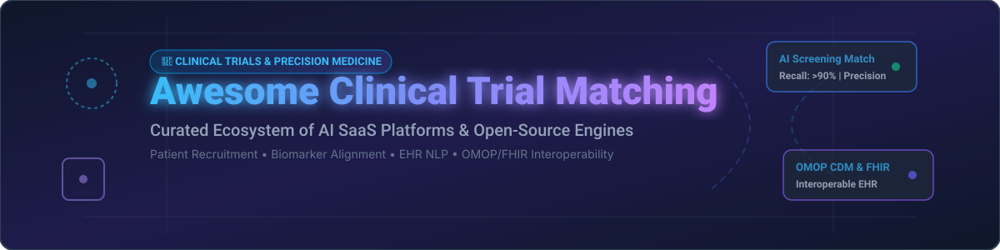
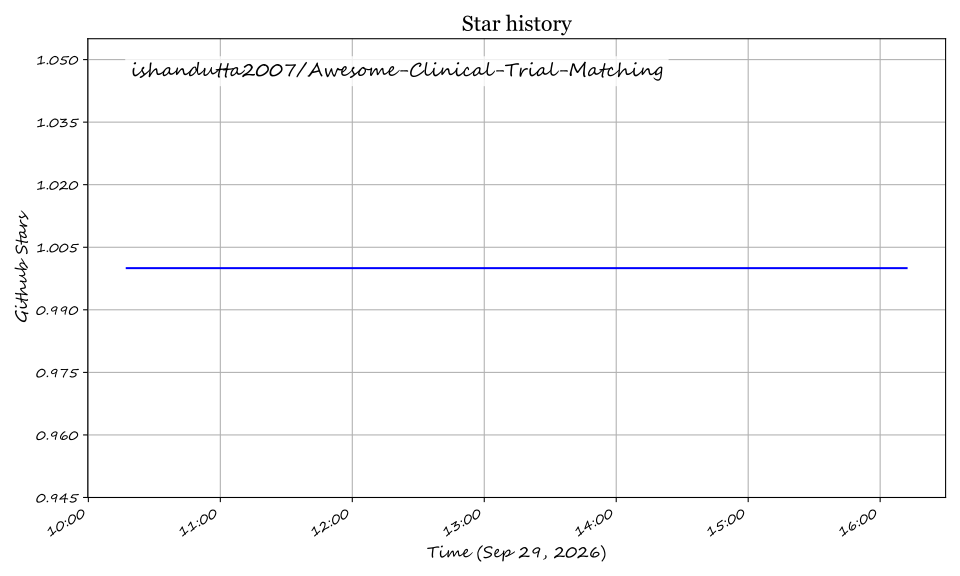

# 🧬 Awesome Clinical Trial Matching

  
  
  
  

## 🚀 Top Clinical Trial Matching Platforms Ecosystem

**Curated List of SaaS Products & Open-Source GitHub Projects**

*Focused on Patient-to-Trial Matching, Eligibility Screening, Biomarker Alignment, EHR Data Mining & Recruitment Automation*

**Last updated: September 2026**

This repository tracks notable **SaaS platforms** and **open-source projects** for **Clinical Trial Matching**. These state-of-the-art tools help healthcare research institutions, CROs, and sponsors identify eligible patients for clinical trials by matching patient profiles—clinical notes, genomic biomarkers, and demographic data—against complex trial eligibility criteria.

---

## 📌 Table of Contents

- [📊 Market Overview & Industry Dynamics](#-market-overview--industry-dynamics)
- [💼 SaaS/Hosted Platforms](#-saashosted-platforms)
- [🔓 Open-Source GitHub Projects](#-open-source-github-projects)
- [🤝 How to Contribute](#-how-to-contribute)
- [⚠️ Disclaimer](#%EF%B8%8F-disclaimer)
- [☕ Support & Sponsorship](#-support--sponsorship)
- [📈 Star History](#-star-history)

---

## 📊 Market Overview & Industry Dynamics

> **Estimated Market Size & Structure**: The global **Clinical Trial Matching & Patient Recruitment Software market** is estimated at **$200M–$228M in 2026** (projected to reach **$413M by 2031** at a 12.6% CAGR), while the broader **AI-based Patient Matching Solutions market** reached **$576M in 2025** (growing at a 31.7% CAGR). The sector is **highly fragmented** due to deep therapeutic specialization (e.g., precision oncology vs. rare disease), regional data privacy regulations (HIPAA, GDPR), and complex site-level EHR integration friction.

---

## 💼 SaaS/Hosted Platforms

The commercial landscape includes enterprise SaaS providers sorted by company size (valuation/revenue, descending):

| Platform | Company Size (Valuation / Revenue) | Starting Tier Pricing | Free Tier / Trial Limits | Description |
| :--- | :--- | :--- | :--- | :--- |
| **[Tempus](https://www.tempus.com/)** | **$12.4B - $15.3B** Market Cap (~$1.6B 2026E Revenue) | $150,000/year (Enterprise TIME Network License) | No free tier; 30-day proof-of-concept pilot available for select academic health centers | Precision medicine & AI trial matching (acquired Deep 6 AI in 2025). Uses TIME Network for JIT trial activation. |
| **[Medable](https://www.medable.com/)** | **$2.1B** Valuation ($521M total funding) | $50,000/study (Platform Core Starter Tier) | No free tier; 14-day interactive sandbox demo for enterprise sponsors | Decentralized clinical trial platform with eConsent, ePRO, and patient recruitment tools. |
| **[Flatiron Health](https://flatiron.com/)** | **$1.9B** Acquisition (by Roche, ~$300M ARR) | $100,000/year (Real-World Evidence Dataset License) | No free tier; custom demo sandbox access upon institutional request | Oncology real-world data & trial pre-screening provider using LLM-supported EHR data extraction. |
| **[TrialJectory](https://www.trialjectory.com/)** | **$104M** Valuation (Merged into Leal Health) | Free for Patients; $25,000/trial listing for Sponsors | **100% Free Forever for Patients** (unlimited trial searches & AI matching) | Patient-facing AI platform matching cancer patients to clinical trials based on medical history. |
| **[Inato](https://www.inato.com/)** | **~$80M** Valuation ($37.5M total funding) | $15,000/site/year (Community Site Marketplace Tier) | Free tier available for community sites (up to 3 active trial applications/year) | Site and patient matching platform connecting trial sponsors with community research centers. |
| **[Deep 6 AI](https://deep6.ai/)** | Acquired by **Tempus AI** ($54.8M total funding) | $75,000/year (Hospital Health System License) | No free tier; 30-day institutional data audit trial | AI-powered clinical trial matching software mining unstructured EHR notes for eligibility criteria. |
| **[TriNetX](https://www.trinetx.com/)** | Private (Majority owned by **The Carlyle Group**) | $40,000/year (Research Network Member Tier) | Free basic access for credentialed academic researchers (RWD query limits apply) | Global health research network providing federated RWD analytics and trial candidate identification. |
| **[Curebase](https://www.curebase.com/)** | Series B Stage ($59M total funding, ~$17.7M ARR) | $35,000/protocol (Decentralized Trial Starter) | No free tier; 30-day trial simulation sandbox | Decentralized clinical trial platform with patient matching and site recruitment automation. |
| **[Mendel AI](https://www.mendel.ai/)** | Series B Stage ($40M+ total funding, ~$15M ARR) | $30,000/year (Clinical AI Data Curation Tier) | No free tier; 14-day trial evaluation on sample EHR cohort | Clinical data curation and trial matching platform using domain-specific NLP on clinical notes. |
| **[Massive Bio](https://www.massivebio.com/)** | Series B Stage ($23.3M total funding) | Free for Patients; $20,000/trial cohort for Sponsors | **100% Free Forever for Patients** (oncology screening & concierge nurse assistance) | AI-driven clinical trial matching platform focused on oncology patient recruitment and screening. |

---

## 🔓 Open-Source GitHub Projects

Top self-hostable open-source engines sorted by GitHub Stars_Count (descending):

- **[ClinTrialFinder](https://github.com/chncwang/ClinTrialFinder)**   
  🤖 **AI-powered clinical trial matching tool using GPT-4.1-mini & Perplexity AI.** Automatically evaluates patient summaries against eligibility criteria and provides evidence-backed rationale.

- **[MatchMiner](https://github.com/dfci/matchminer)**   
  🏥 **Production-deployed precision oncology matching engine at Dana-Farber Cancer Institute.** Open-source platform matching patient clinical and genomic profiles to trial criteria. Incorporates AI for unstructured EHR notes and is deployed at Princess Margaret Cancer Centre.

- **[TrialMatchAI](https://github.com/cbib/TrialMatchAI)**   
  ⚡ **State-of-the-art LLM & RAG clinical trial recommendation engine.** Published in *Nature Communications* (2026). Achieves **>90% recall** across 26,000+ trials using fine-tuned open LLMs, Phenopackets, and medical Chain-of-Thought reasoning.

- **[clinicaltrials-multiagent](https://github.com/adityashukla8/clinicaltrials-multiagent)**   
  🧩 **Multi-agent LLM system for trial matching and protocol optimization.** Features autonomous agents for eligibility scoring, web enrichment via Tavily, and biomarker threshold simulation.

- **[CancerTrialMatch](https://github.com/AveraSD/CancerTrialMatch)**   
  🧬 **Biomarker-focused clinical trial matching app from Avera Cancer Institute.** Published in *Bioinformatics* (2025). Leverages OncoTree taxonomy and ClinicalTrials.gov API in an R Shiny/Docker stack.

- **[recruIT](https://gitlab.ukdd.de/pub/num-sn/recruit)** *(GitLab Repo)*  
  🌐 **Cloud-native recruitment support system deployed across 5 German university hospitals.** Built on **OMOP CDM** and **HL7 FHIR** with OHDSI Atlas cohort integration. Achieved a 79.9/100 System Usability Scale score.

- **[TrialGPT Agent (BioDSA)](https://github.com/RyanWangZf/BioDSA)**   
  🔬 **Agentic implementation of the TrialGPT framework** (*Nature Communications* 2024). Extracts clinical features from patient notes and ranks active ClinicalTrials.gov matches using GPT-4o.

---

## 🤝 How to Contribute

1. 🍴 Fork the repository.
2. 📝 Add or update entries in `README.md` following the tabular layout.
3. 🔎 Include key metrics: platform name, link, verified pricing tier, free tier limits, company size/stars, and description.
4. 📬 Submit a Pull Request with a clear summary of changes.

---

## ⚠️ Disclaimer

- This list is **community-curated** for research and educational purposes.
- Clinical trial matching platforms process sensitive protected health information (PHI); implementations must comply with HIPAA, GDPR, and local regulations.

---

## ☕ Support & Sponsorship

If you find this curated list valuable for your clinical informatics research, precision medicine projects, or trial recruitment workflows, please consider supporting the project:

- ⭐ **Star** this repository to increase visibility.
- 🔀 **Fork** and contribute new tools or research frameworks.
- 📢 **Share** with colleagues and research networks.
- 💖 **Sponsor**: [Buy me a coffee on GitHub Sponsors](https://github.com/sponsors/ishandutta2007) to help maintain awesome open-source healthtech resources!

---

## 📈 Star History

---

**Made with ❤️ for clinical research informaticists, oncology coordinators, precision medicine teams, and health-tech developers.**

## ⭐ Star History

<a href="https://star-history.com/#ishandutta2007/Awesome-Clinical-Trial-Matching&Timeline" align="center">
  <picture>
    <source media="(prefers-color-scheme: dark)" srcset="assets/ishandutta2007_Awesome-Clinical-Trial-Matching_growth.svg">
    
  </picture>
</a>
